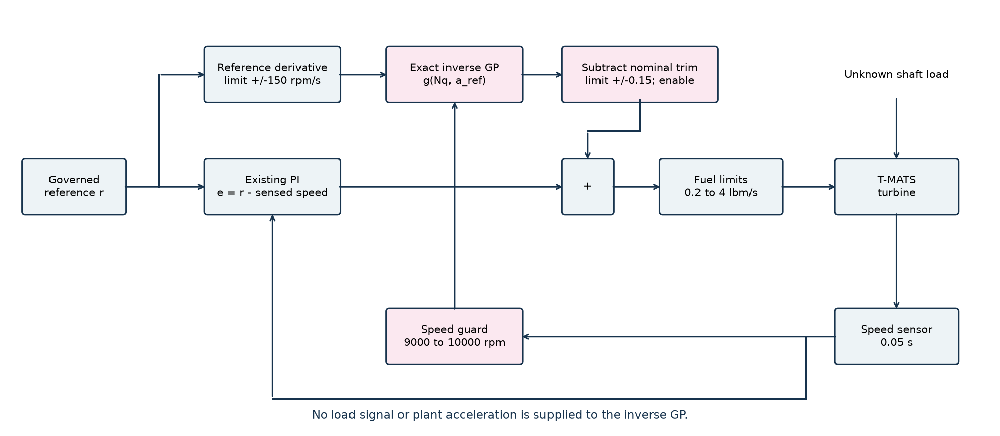
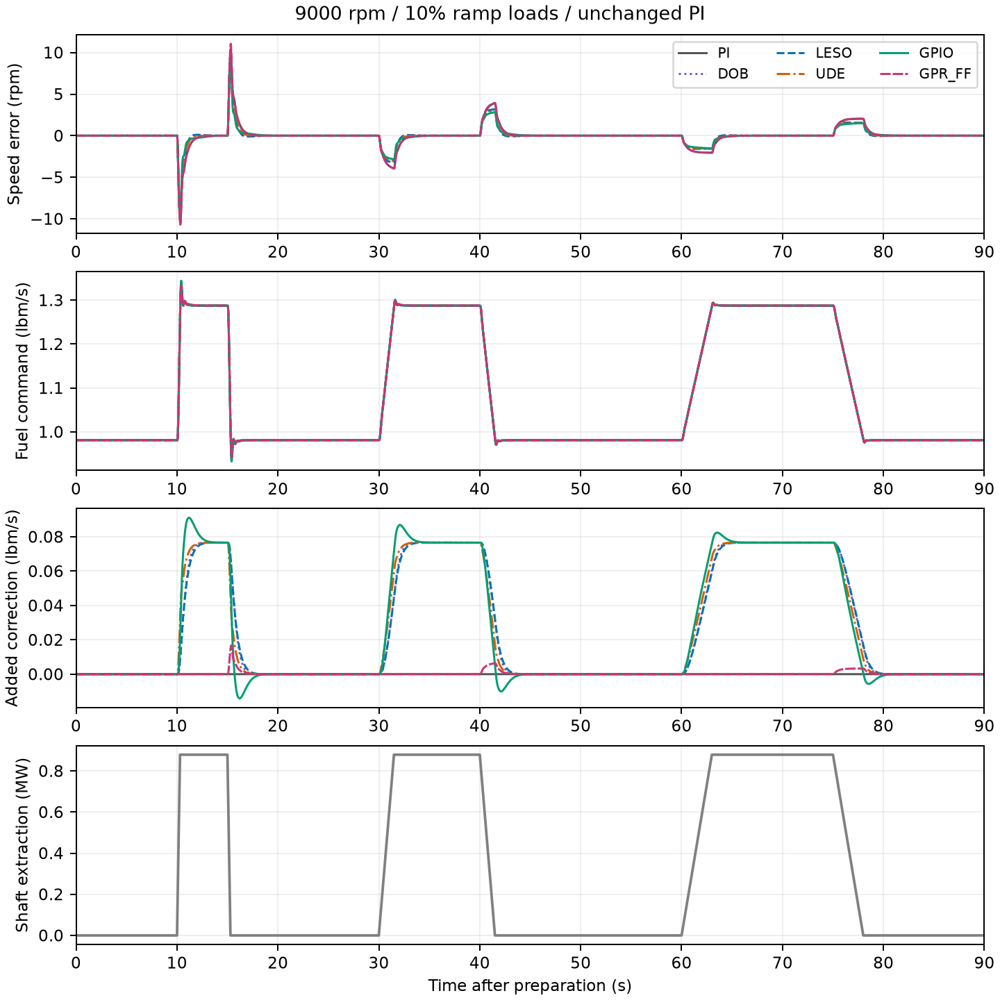
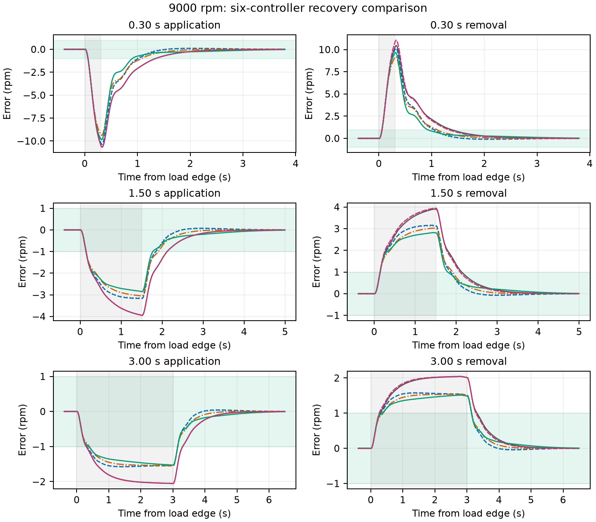
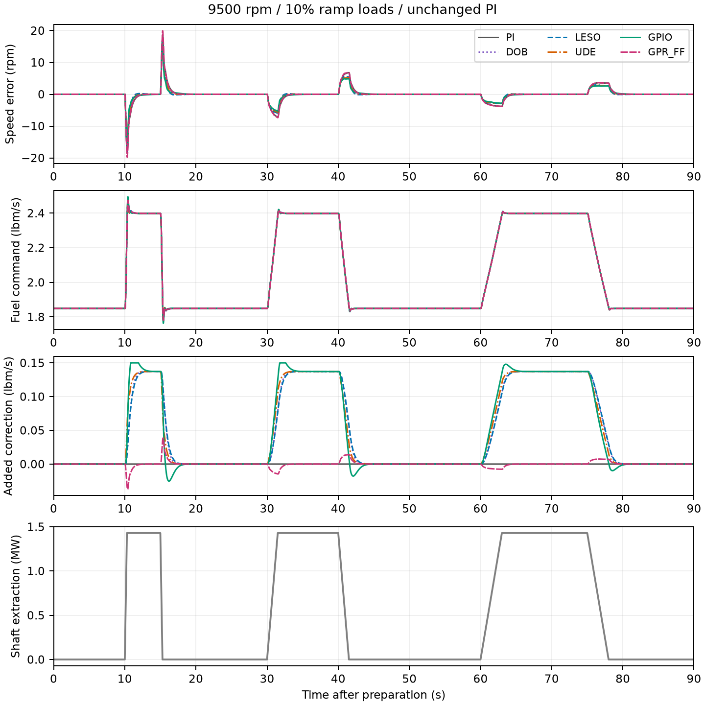
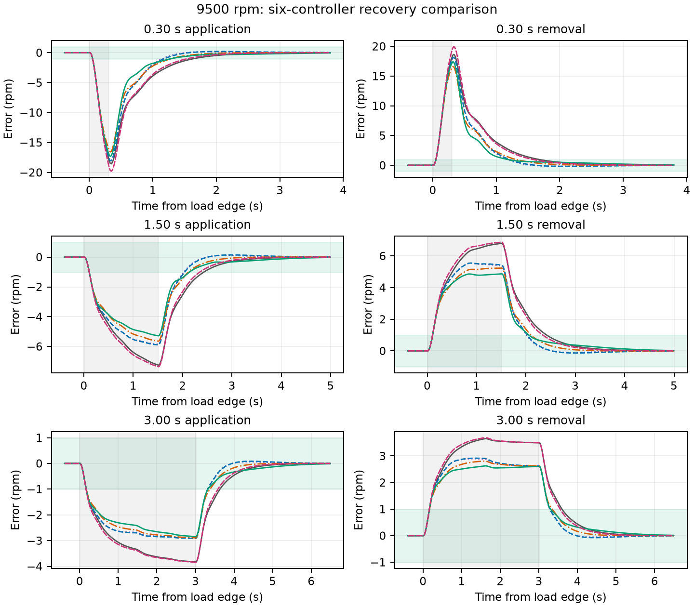
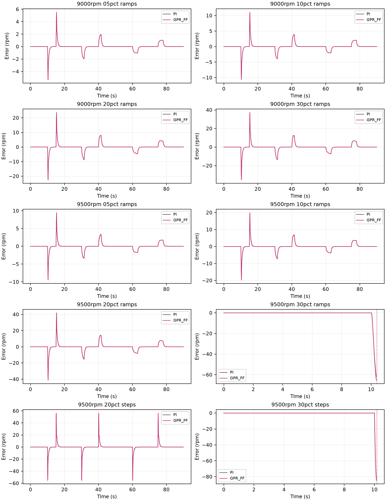

# Six-controller comparison with inverse GPR feedforward

GPR_FF is the inverse-GP feedforward requested as GPT FF. It augments the original PI; it is not a disturbance observer. All 60 runs are new Simulink simulations. The previous five controllers at 10% load reproduce the archived speed histories within 1e-6 rpm.

## Controller

`a_ref[k] = clip((r[k]-r[k-1])/0.015, -150, 150)`

`Nq[k] = clip(N_sensed[k], 9000, 10000)`

`delta_u_FF[k] = rho(t) * clip(g(Nq[k],a_ref[k])-g(N_nominal,0), -0.15, 0.15)`

`u[k] = clip(u_PI[k] + delta_u_FF[k], 0.2, 4)`

The original continuous PI retains Kp=0.025, Ki=0.05 and integrator initialization 3. The sensor time constant remains 0.05 s. rho ramps from 0 to 1 over absolute seconds 30-32. No observer compensation is active in GPR_FF. No shaft-load value, future disturbance schedule, actual plant acceleration, or inverse-model refit is supplied to the controller.

The observer branches retain their inherited compensation gain 0.25 and pole-frequency parameter 0.5 Hz. The physical inverse-GP correction uses unit gain before the same +/-0.15 lbm/s limit; it is not bandwidth-matched to the observers. No noise, delay, or gain-tuning comparison is claimed.

This is state-scheduled nominal feedforward: sensed speed schedules the inverse model. It is not purely reference-only feedforward; that would remain constant throughout these constant-reference tests. There is no extra speed-error-to-acceleration gain. The trim subtraction prevents double-counting equilibrium fuel already supplied by the inherited PI integrator. The speed guard prevents extrapolation below the 9000 rpm training boundary, but can make the 9000 rpm response asymmetric.

The inverse model is the frozen 600-point exact ARD squared-exponential GP. Online mean evaluation is O(600); its 100-point held-out inverse fuel RMSE was 0.001048216 lbm/s and 95% response interval coverage was 97%. Fuel uncertainty is evaluated offline on up to 100 valid samples per control run; it is not used as a control gain or as a bound on loaded-plant error.

## Matched 10% observer comparison

| Speed | Load | Shape | Method | Valid | RMSE rpm | Peak rpm | IAE rpm s | Failure s |
|---:|---:|---|---|---|---:|---:|---:|---:|
| 9000 | 10% | ramps | PI | True | 1.193 | 10.677 | 36.774 | N/A |
| 9000 | 10% | ramps | DOB | True | 1.038 | 10.351 | 28.341 | N/A |
| 9000 | 10% | ramps | LESO | True | 1.039 | 10.349 | 28.694 | N/A |
| 9000 | 10% | ramps | UDE | True | 0.969 | 9.377 | 27.587 | N/A |
| 9000 | 10% | ramps | GPIO | True | 0.951 | 9.866 | 27.577 | N/A |
| 9000 | 10% | ramps | GPR_FF | True | 1.208 | 11.058 | 36.774 | N/A |
| 9500 | 10% | ramps | PI | True | 2.125 | 18.642 | 65.863 | N/A |
| 9500 | 10% | ramps | DOB | True | 1.850 | 18.147 | 50.799 | N/A |
| 9500 | 10% | ramps | LESO | True | 1.853 | 18.155 | 51.429 | N/A |
| 9500 | 10% | ramps | UDE | True | 1.730 | 16.574 | 49.411 | N/A |
| 9500 | 10% | ramps | GPIO | True | 1.698 | 17.393 | 49.392 | N/A |
| 9500 | 10% | ramps | GPR_FF | True | 2.192 | 19.938 | 65.864 | N/A |

## Findings

At 9000 rpm, GPR_FF RMSE is 1.207770 rpm versus PI 1.193143 rpm (+1.23% change; positive is worse). Peak error is 11.057788 rpm. Speed guard active: 34.04% of evaluation samples.
GPR_FF +/-1 rpm recovery at 9000 rpm is faster than PI in 3/6 events, equal in 3/6, and slower in 0/6. Thus the larger peaks and RMSE coexist with faster threshold recovery; these metrics must not be collapsed into a single blanket ranking.
At 9500 rpm, GPR_FF RMSE is 2.191826 rpm versus PI 2.125136 rpm (+3.14% change; positive is worse). Peak error is 19.937677 rpm. Speed guard active: 0.00% of evaluation samples.
GPR_FF +/-1 rpm recovery at 9500 rpm is faster than PI in 6/6 events, equal in 0/6, and slower in 0/6. Thus the larger peaks and RMSE coexist with faster threshold recovery; these metrics must not be collapsed into a single blanket ranking.

A nominal inverse learned at zero external shaft load cannot anticipate an unknown load. Accurate offline inverse regression does not imply improved rejection. In these tests a_ref is zero during evaluation, so the FF branch only schedules nominal fuel with sensed speed; the PI integrator supplies the additional load-dependent fuel. A learned increase in equilibrium fuel with speed can reduce effective restoring feedback when added to the unchanged PI. Results are reported without retuning to favor the GP.

Regression of unclipped FF correction against sensed speed on the matched runs gives slopes 0.0015974 and 0.0020183 lbm/s per rpm at 9000 and 9500 rpm, respectively. These are descriptive trajectory fits, not independent linearizations; the 9000 rpm fit excludes the active speed guard.

## All load scenarios

| Speed | Load | Shape | Method | Valid | RMSE rpm | Peak rpm | IAE rpm s | Failure s |
|---:|---:|---|---|---|---:|---:|---:|---:|
| 9000 | 5% | ramps | PI | True | 0.594 | 5.325 | 18.309 | N/A |
| 9000 | 5% | ramps | DOB | True | 0.517 | 5.162 | 14.109 | N/A |
| 9000 | 5% | ramps | LESO | True | 0.517 | 5.161 | 14.285 | N/A |
| 9000 | 5% | ramps | UDE | True | 0.483 | 4.677 | 13.735 | N/A |
| 9000 | 5% | ramps | GPIO | True | 0.473 | 4.920 | 13.730 | N/A |
| 9000 | 5% | ramps | GPR_FF | True | 0.601 | 5.515 | 18.309 | N/A |
| 9000 | 10% | ramps | PI | True | 1.193 | 10.677 | 36.774 | N/A |
| 9000 | 10% | ramps | DOB | True | 1.038 | 10.351 | 28.341 | N/A |
| 9000 | 10% | ramps | LESO | True | 1.039 | 10.349 | 28.694 | N/A |
| 9000 | 10% | ramps | UDE | True | 0.969 | 9.377 | 27.587 | N/A |
| 9000 | 10% | ramps | GPIO | True | 0.951 | 9.866 | 27.577 | N/A |
| 9000 | 10% | ramps | GPR_FF | True | 1.208 | 11.058 | 36.774 | N/A |
| 9000 | 20% | ramps | PI | True | 2.540 | 22.553 | 78.110 | N/A |
| 9000 | 20% | ramps | DOB | True | 2.237 | 22.329 | 60.838 | N/A |
| 9000 | 20% | ramps | LESO | True | 2.240 | 22.335 | 61.314 | N/A |
| 9000 | 20% | ramps | UDE | False | N/A | N/A | N/A | 61.530 |
| 9000 | 20% | ramps | GPIO | True | 2.072 | 21.457 | 60.111 | N/A |
| 9000 | 20% | ramps | GPR_FF | True | 2.571 | 23.707 | 78.110 | N/A |
| 9000 | 30% | ramps | PI | True | 3.973 | 35.359 | 121.624 | N/A |
| 9000 | 30% | ramps | DOB | True | 3.664 | 35.258 | 104.370 | N/A |
| 9000 | 30% | ramps | LESO | True | 3.668 | 35.258 | 105.042 | N/A |
| 9000 | 30% | ramps | UDE | True | 3.530 | 35.237 | 103.631 | N/A |
| 9000 | 30% | ramps | GPIO | True | 3.501 | 35.258 | 103.625 | N/A |
| 9000 | 30% | ramps | GPR_FF | True | 4.022 | 37.310 | 121.624 | N/A |
| 9500 | 5% | ramps | PI | True | 1.017 | 8.905 | 31.538 | N/A |
| 9500 | 5% | ramps | DOB | True | 0.885 | 8.667 | 24.317 | N/A |
| 9500 | 5% | ramps | LESO | True | 0.886 | 8.670 | 24.619 | N/A |
| 9500 | 5% | ramps | UDE | True | 0.827 | 7.905 | 23.660 | N/A |
| 9500 | 5% | ramps | GPIO | True | 0.811 | 8.281 | 23.651 | N/A |
| 9500 | 5% | ramps | GPR_FF | True | 1.049 | 9.513 | 31.538 | N/A |
| 9500 | 10% | ramps | PI | True | 2.125 | 18.642 | 65.863 | N/A |
| 9500 | 10% | ramps | DOB | True | 1.850 | 18.147 | 50.799 | N/A |
| 9500 | 10% | ramps | LESO | True | 1.853 | 18.155 | 51.429 | N/A |
| 9500 | 10% | ramps | UDE | True | 1.730 | 16.574 | 49.411 | N/A |
| 9500 | 10% | ramps | GPIO | True | 1.698 | 17.393 | 49.392 | N/A |
| 9500 | 10% | ramps | GPR_FF | True | 2.192 | 19.938 | 65.864 | N/A |
| 9500 | 20% | ramps | PI | True | 4.453 | 39.270 | 137.688 | N/A |
| 9500 | 20% | ramps | DOB | True | 4.148 | 39.270 | 120.437 | N/A |
| 9500 | 20% | ramps | LESO | True | 4.152 | 39.270 | 121.213 | N/A |
| 9500 | 20% | ramps | UDE | True | 4.024 | 39.270 | 119.694 | N/A |
| 9500 | 20% | ramps | GPIO | True | 3.985 | 39.270 | 119.688 | N/A |
| 9500 | 20% | ramps | GPR_FF | True | 4.593 | 41.941 | 137.689 | N/A |
| 9500 | 30% | ramps | PI | False | N/A | N/A | N/A | 10.380 |
| 9500 | 30% | ramps | DOB | False | N/A | N/A | N/A | 10.380 |
| 9500 | 30% | ramps | LESO | False | N/A | N/A | N/A | 10.380 |
| 9500 | 30% | ramps | UDE | False | N/A | N/A | N/A | 10.380 |
| 9500 | 30% | ramps | GPIO | False | N/A | N/A | N/A | 10.365 |
| 9500 | 30% | ramps | GPR_FF | False | N/A | N/A | N/A | 10.380 |
| 9500 | 20% | steps | PI | True | 6.430 | 54.100 | 137.688 | N/A |
| 9500 | 20% | steps | DOB | True | 6.203 | 54.100 | 120.508 | N/A |
| 9500 | 20% | steps | LESO | True | 6.207 | 54.100 | 121.530 | N/A |
| 9500 | 20% | steps | UDE | True | 5.989 | 54.100 | 119.694 | N/A |
| 9500 | 20% | steps | GPIO | True | 6.016 | 54.100 | 119.688 | N/A |
| 9500 | 20% | steps | GPR_FF | True | 6.712 | 56.329 | 137.689 | N/A |
| 9500 | 30% | steps | PI | False | N/A | N/A | N/A | 10.155 |
| 9500 | 30% | steps | DOB | False | N/A | N/A | N/A | 10.155 |
| 9500 | 30% | steps | LESO | False | N/A | N/A | N/A | 10.155 |
| 9500 | 30% | steps | UDE | False | N/A | N/A | N/A | 10.140 |
| 9500 | 30% | steps | GPIO | False | N/A | N/A | N/A | 10.155 |
| 9500 | 30% | steps | GPR_FF | False | N/A | N/A | N/A | 10.155 |

At both speeds, 5%, 10%, 20%, and 30% gross-turbine-power extraction uses three ramp/hold/ramp pulses (0.30, 1.50, 3.00 s). The earlier 9500 rpm 20% and 30% step-load cases are repeated too. Application times are 10.005, 30, 60 s; removal times 15, 40.005, 75 s after 60 s preparation. The 9500 rpm ramped 5/20/30% cases extend the previous matrix. Loads are speed-specific fractions, not equal absolute powers.

## Validity and recovery

Validity requires finite logged signals, positive fuel, positive compressor margin, flow residual <=1e-9, and fewer than 200 iterations. Full-run scores are withheld after any invalid solve; plots show only the valid prefix. A later numerically converged sample does not rehabilitate the trajectory. Shaft balance and command reconstruction are verified independently. Identical load profiles are checked across methods.

Recovery is the first sample after the last excursion outside +/-1 rpm with at least 0.5 s dwell before the next load edge. After-ramp recovery subtracts ramp duration and is bounded below by zero. Event scores are withheld if any preceding sample is invalid. All 360 event records are in events.csv.

## Reproduce

`run_tmats_gpr_ff_benchmarks` builds GasTurbine_Dyn_Template_GPR_FF.mdl and runs the matrix. Then run `summarize_tmats_gpr_ff.py`. The previous models and trained inverse GP remain separate. The new Level-2 MATLAB S-function is a desktop simulation implementation, not an embedded code-generation claim.

References: Aran (2019), thesis sections 5.1 and 6.2.1; Rasmussen and Williams, Gaussian Processes for Machine Learning, chapter 2. Previous report derivations for the inherited PI/DOB/LESO/UDE/GPIO remain applicable.

## 9000 rpm plots

## 9500 rpm plots

## First-invalid-sample diagnostics

| Scenario | Method | Time s | Flow residual | Iterations | Margin % |
|---|---|---:|---:|---:|---:|
| 9000rpm_20pct_ramps | UDE | 61.530 | 1.45e-05 | 200 | 25.679 |
| 9500rpm_30pct_ramps | PI | 10.380 | 0.00119 | 200 | 0.000 |
| 9500rpm_30pct_ramps | DOB | 10.380 | 0.00304 | 200 | 0.000 |
| 9500rpm_30pct_ramps | LESO | 10.380 | 0.00332 | 200 | 0.000 |
| 9500rpm_30pct_ramps | UDE | 10.380 | 0.000294 | 200 | 0.000 |
| 9500rpm_30pct_ramps | GPIO | 10.365 | 8.86e-05 | 200 | 0.000 |
| 9500rpm_30pct_ramps | GPR_FF | 10.380 | 0.000656 | 200 | 0.000 |
| 9500rpm_30pct_steps | PI | 10.155 | 0.00647 | 200 | 0.000 |
| 9500rpm_30pct_steps | DOB | 10.155 | 0.00804 | 200 | 0.000 |
| 9500rpm_30pct_steps | LESO | 10.155 | 0.00801 | 200 | 0.000 |
| 9500rpm_30pct_steps | UDE | 10.140 | 0.00154 | 200 | 0.000 |
| 9500rpm_30pct_steps | GPIO | 10.155 | 0.0107 | 200 | 0.000 |
| 9500rpm_30pct_steps | GPR_FF | 10.155 | 0.00119 | 200 | 0.000 |
## Wider load tests

