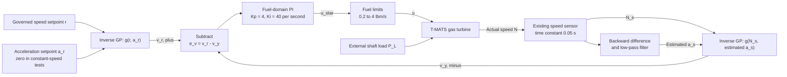
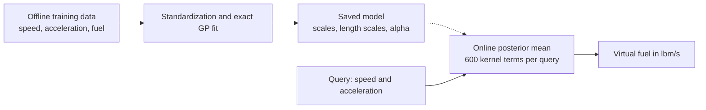
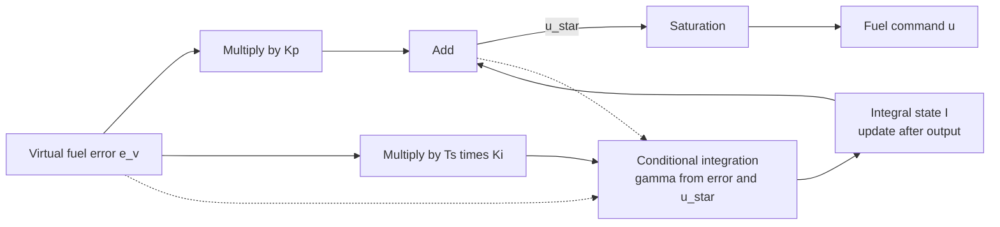
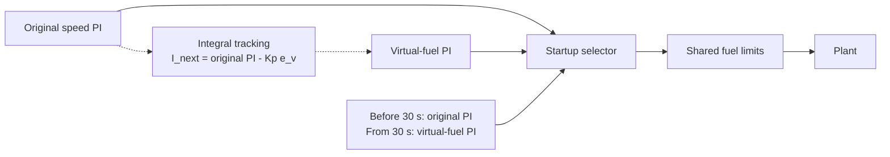
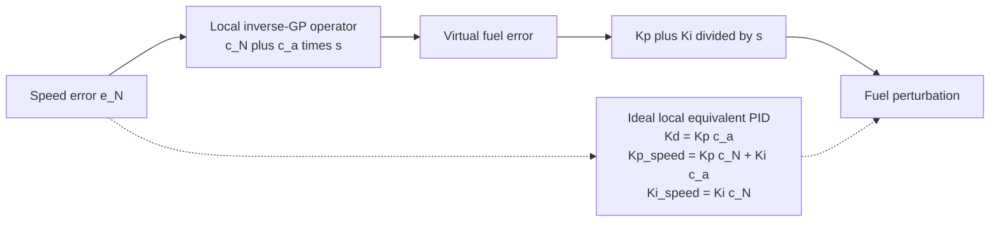
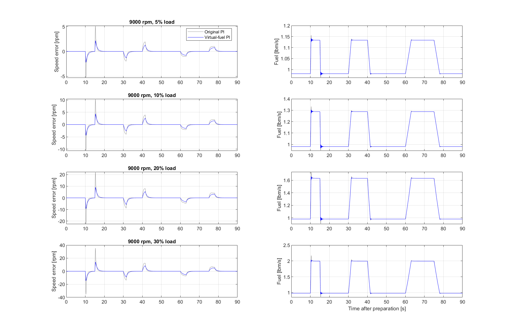
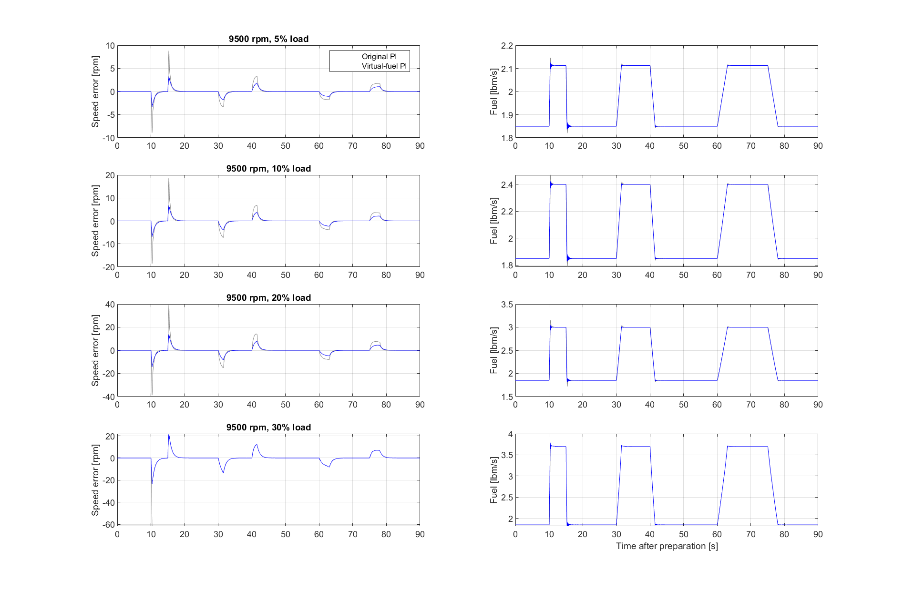
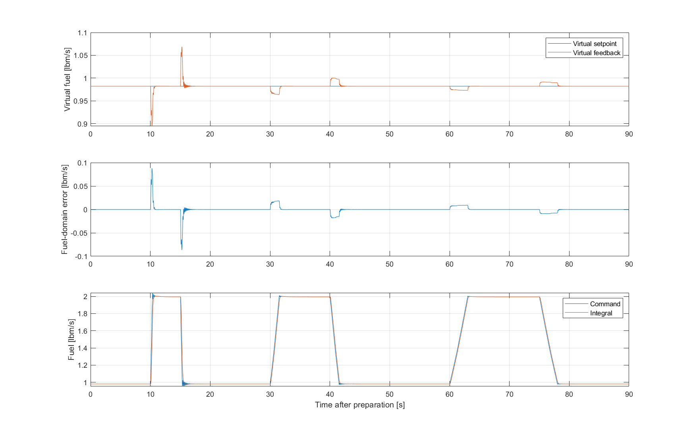
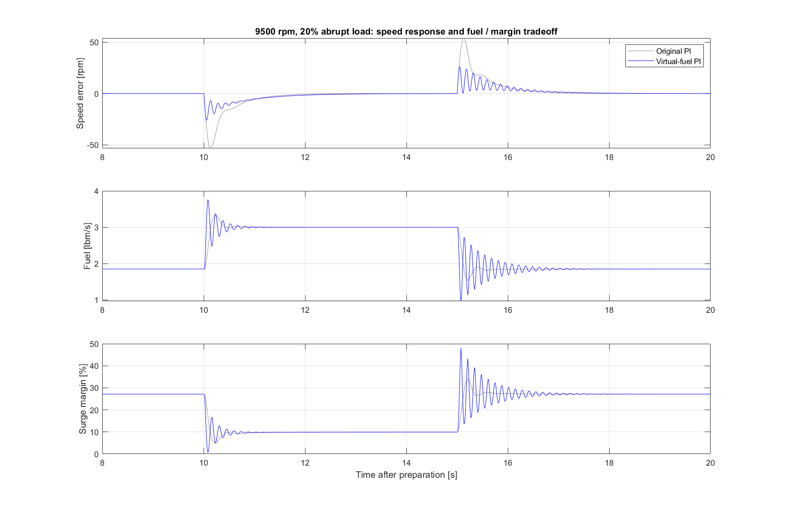

# Dual inverse-GPR virtual-fuel PI study

Selected **Kp = 4**, **Ki = 40 1/s**. Original speed PI: Kp = 0.025, Ki = 0.05. The new gains act on fuel error and are not numerically comparable to speed-domain gains.

At 9000 rpm, the mean reduction in ramp-case RMSE is 37.74%. At 9500 rpm, speed tracking also improves on valid comparison cases, but the 20% abrupt-load test reduces minimum surge margin to 0.673%. Full-run comparisons below exclude invalid cases.

The same frozen inverse GP computes g(Nsp,0) and g(Ns,estimated acceleration). Their difference drives a discrete PI, with its integral initialized by tracking the startup controller until 30 s. No original speed PI or GPR feedforward is added after handover. Feedback acceleration is estimated causally from sensed speed with a 0.03 s low-pass filter. Sampling interval is 0.015 s. Fuel limits are 0.2 to 4 lbm/s, with conditional-integration anti-windup.

## Controller concept and signal definitions

The idea is to compare the requested and measured motion of the shaft in a common **nominal fuel coordinate**. The inverse Gaussian-process regression (GPR) model answers: *under the nominal conditions represented by the training data, what fuel flow corresponds to this speed and acceleration?* The same learned mapping is evaluated twice. One evaluation represents the desired motion, and the other represents measured motion. A PI controller acts on their difference and generates the actual fuel command.

Here, “projection” means a nonlinear mapping from two motion variables to one fuel-valued coordinate. It is not an orthogonal geometric projection, a globally invertible coordinate transformation, or a guarantee that different motion states have different virtual fuels.

| Symbol | Meaning | Unit |
|---|---|---|
| \(N\) | Actual shaft speed | rpm |
| \(N_s\) | Sensed speed, after the existing sensor dynamics | rpm |
| \(r\) | Governed speed setpoint | rpm |
| \(a_r\) | Explicit acceleration setpoint | rpm/s |
| \(\hat a_s\) | Acceleration estimated from sensed speed | rpm/s |
| \(g(N,a)\) | Frozen inverse-GPR posterior mean | lbm/s |
| \(v_r, v_y\) | Virtual fuel setpoint and feedback | lbm/s |
| \(e_v=v_r-v_y\) | Fuel-domain control error | lbm/s |
| \(I\) | Integral contribution to the fuel command | lbm/s |
| \(u^\star, u\) | Unsaturated and limited fuel commands | lbm/s |
| \(P_L\) | External shaft-power extraction | hp in the test implementation |
| \(T_s\) | Controller sampling interval | 0.015 s |

The actual test architecture is shown below. The external load acts on the plant; it is not an input to either GP or to the PI controller.

**Figure 1. Active controller after startup handover.** Both GP blocks use identical frozen parameters. The PI output passes through the shared fuel limits. Anti-windup and startup switching are detailed below. The plant-acceleration signal recorded in the results is a validation signal, not a controller input.

### The two projections

At sample \(k\), the virtual quantities are

\[
v_r[k]=g\!\left(r[k],a_r[k]\right),\qquad
v_y[k]=g\!\left(N_s[k],\hat a_s[k]\right),
\tag{1}
\]

\[
e_v[k]=v_r[k]-v_y[k].
\tag{2}
\]

For the disturbance tests, the speed reference is constant during evaluation:

\[
r[k]=N_0,\qquad a_r[k]=0,
\qquad N_0\in\{9000,9500\}\;\mathrm{rpm}.
\tag{3}
\]

Consequently, \(v_r=g(N_0,0)\) is constant. The virtual feedback changes when speed or estimated acceleration changes. A load increase initially produces deceleration; with the positive local acceleration slope of this GP, that deceleration lowers virtual feedback and produces a positive fuel-domain error. The controller then increases fuel.

For a varying-speed application, the explicit acceleration input should be consistent with the **governed** reference trajectory, ideally \(a_r=\dot r\). Differentiating an ungoverned discontinuous speed step would give an unsuitable acceleration demand. The saved disturbance model uses a constant-zero acceleration block; automatic generation of acceleration setpoints for general reference trajectories is not part of these tests.

## Mathematical form of the inverse GPR

The inverse model was fitted directly to speed, acceleration, and fuel observations. It has 600 training observations and an automatic-relevance-determination squared-exponential covariance. Its inputs are standardized before kernel evaluation. For an input \(x=[N\;a]^\mathsf T\), write

\[
z_j(x)=\frac{x_j-\mu_{x,j}}{s_{x,j}},\qquad
\tilde w_i=\frac{w_i-\mu_w}{s_w},
\tag{4}
\]

\[
\kappa(z,z')=\sigma_f^2
\exp\!\left[-\frac12\sum_{j=1}^{2}
\frac{(z_j-z'_j)^2}{\ell_j^2}\right].
\tag{5}
\]

With \(K_{ij}=\kappa(z_i,z_j)\), the exported posterior weights and prediction are

\[
\alpha=(K+\sigma_n^2\mathcal I)^{-1}\tilde{\mathbf w},
\qquad
g(x)=\mu_w+s_w\,\mathbf k_x^\mathsf T\alpha,
\tag{6}
\]

where \((\mathbf k_x)_i=\kappa(z_i,z(x))\), and \(\mathcal I\) denotes an identity matrix, distinct from the controller integral state \(I\).

The training solve and matrix factorization are offline operations. During control, each GP mean evaluation uses the saved weights and 600 kernel terms. The implementation precomputes standardized training inputs divided by their length scales. It does not refit the GP or solve a 600-by-600 system at each control sample.

**Figure 2. Offline identification and online use.** The controller uses the posterior mean only. The exported predictor can also calculate uncertainty, but that uncertainty is not used for gain adjustment, command limiting, or switching in this implementation.

For reference, if \(LL^\mathsf T=K+\sigma_n^2\mathcal I\), the exported latent-function variance is

\[
\sigma_g^2(x)=s_w^2\left[\kappa(z(x),z(x))-
\lVert L^{-1}\mathbf k_x\rVert_2^2\right],
\tag{7}
\]

with numerical negative roundoff clipped to zero. Response variance additionally includes \(s_w^2\sigma_n^2\). These uncertainties do not propagate sensor-input uncertainty or establish closed-loop stability. Errors at the two GP queries are generally correlated; their difference uncertainty cannot generally be obtained by simply adding the two marginal variances.

Using the same GP on both sides has a useful cancellation property: identical query pairs produce exactly the same prediction, even if the GP has a bias relative to the physical engine. This does not cancel state-dependent model error when the two queries differ, nor does it make the GP a physical inverse under an external load.

## What virtual fuel means under a shaft load

The inverse GP was trained without external shaft-power extraction. Therefore, \(v_y\) is the nominal fuel coordinate associated with the measured motion; it is **not** an estimate of actual injected fuel under arbitrary load.

A local illustrative shaft model makes this distinction clear. Let \(n=N-N_0\), let \(\delta u\) be fuel deviation from the unloaded operating point, and let \(d_a\) be an external load expressed as an equivalent deceleration:

\[
\dot n=-\lambda n+b\,\delta u-d_a,
\qquad b>0.
\tag{8}
\]

If a nominal inverse were exact for this simplified model, it would be

\[
g(N_0+n,\dot n)\approx u_0+
\frac{\lambda}{b}n+\frac{1}{b}\dot n
=u_0+\delta u-\frac{d_a}{b}.
\tag{9}
\]

Thus the virtual feedback omits the additional fuel needed to balance external load. At a recovered constant-speed equilibrium,

\[
n=0,\qquad \dot n=0,\qquad
v_y=v_r=g(N_0,0),\qquad e_v=0,
\tag{10}
\]

but the actual fuel can be higher:

\[
u=u_0+\frac{d_a}{b},\qquad I=u.
\tag{11}
\]

The integral state retains the load-compensating fuel even after the virtual error returns to zero. It is therefore expected that the virtual fuel traces return close to their unloaded value while the actual fuel command remains elevated during a load plateau.

Equations (8)–(11) explain the mechanism; they are not an additional identified model used in the simulation. For the nonlinear GP, \(g(N_s,0)=g(r,0)\) implies \(N_s=r\) only where the zero-acceleration mapping is locally one-to-one. Positive local speed slopes were found at the two operating points, but global uniqueness is not established. During transients, zero virtual error can also result from speed and acceleration contributions cancelling each other.

## Exact sampled implementation

### Acceleration from sensed speed

The existing first-order sensor has time constant 0.05 s, and its noise option is disabled for the reported tests. The controller estimates acceleration from its output, not from true plant acceleration:

\[
p=\exp(-T_s/\tau_a),\qquad T_s=0.015\;\mathrm{s},
\qquad\tau_a=0.03\;\mathrm{s},
\tag{12}
\]

\[
\hat a_s[k]=p\hat a_s[k-1]+(1-p)
\frac{N_s[k]-N_s[k-1]}{T_s}.
\tag{13}
\]

Here \(p=\exp(-0.5)\approx0.60653\). The corresponding zero-initial-condition transfer function is

\[
D_a(z)=\frac{\hat A_s(z)}{N_s(z)}=
\frac{(1-p)(1-z^{-1})}{T_s(1-pz^{-1})}.
\tag{14}
\]

This causal filtered difference adds delay and attenuates high-frequency differentiation relative to an unfiltered difference. It does not eliminate sensitivity to sensor noise. Both sensor dynamics and acceleration estimation matter when interpreting oscillatory responses.

### PI output, limits, and anti-windup

The active fuel controller evaluates its output using the current integral state:

\[
u^\star[k]=K_p e_v[k]+I[k],\qquad
u[k]=\operatorname{sat}_{[u_{\min},u_{\max}]}(u^\star[k]),
\tag{15}
\]

\[
K_p=4,\qquad K_i=40\;\mathrm{s}^{-1},\qquad
u_{\min}=0.2,\quad u_{\max}=4.0\;\mathrm{lbm/s}.
\tag{16}
\]

Because \(e_v\) already has fuel-flow units, \(K_p\) is dimensionless and \(K_i\) has units of inverse seconds. The original speed PI gains act on rpm error and have different units.

Define the integration-enable condition

\[
\gamma[k]=
\begin{cases}
1,&(u^\star[k]<u_{\max}\;\lor\;e_v[k]<0)
\;\land\;(u^\star[k]>u_{\min}\;\lor\;e_v[k]>0),\\
0,&\text{otherwise}.
\end{cases}
\tag{17}
\]

The update is then

\[
I[k+1]=I[k]+\gamma[k]T_sK_i e_v[k].
\tag{18}
\]

At the upper limit, a positive error cannot further increase the integral, but a negative error may unwind it. The opposite applies at the lower limit. This is conditional integration, not a back-calculation anti-windup law. The fuel limit is not a surge-margin limiter.

**Figure 3. Fuel-domain PI realization.** The dotted connections determine whether to integrate. They do not supply an additional correction term to the command.

### Startup and handover

The engine starts at 10000 rpm and is brought to its operating point by the original speed PI. The new controller computes its projections during this preparation but takes control only at 30 s. Before handover, its integral tracks the original PI:

\[
u_{\mathrm{selected}}[k]=u_{\mathrm{PI}}[k],\qquad
I[k+1]=u_{\mathrm{PI}}[k]-K_p e_v[k],
\quad kT_s<30\;\mathrm{s}.
\tag{19}
\]

At and after 30 s, equations (15)–(18) apply. The selected command always passes through the shared external fuel limits. In the baseline mode, the original PI stays selected for the complete run.

**Figure 4. Startup selection.** Once the new controller is active, the original speed PI is not added to its output. Tracking uses the preceding sample, so the handover is approximately bumpless rather than an exact simultaneous algebraic match under rapidly changing signals.

Specifically, at the first active sample \(k_h\), assuming the preceding tracking update ran,

\[
u^\star[k_h]-u_{\mathrm{PI}}[k_h-1]
=K_p\big(e_v[k_h]-e_v[k_h-1]\big).
\tag{20}
\]

The state initializations are \(N_s[-1]=10000\) rpm, \(\hat a_s[-1]=0\), and \(I[0]=3\) lbm/s. Evaluation starts at 60 s, leaving 30 s between handover and the scored test interval. Startup solely under the new controller has not been validated.

## Local interpretation: a nonlinear counterpart of PID action

Let

\[
c_N=\left.\frac{\partial g}{\partial N}\right|_{(N_0,0)},\qquad
c_a=\left.\frac{\partial g}{\partial a}\right|_{(N_0,0)}.
\tag{21}
\]

In the transfer-function derivations below, \(U\) denotes a fuel perturbation about equilibrium; initial-state contributions are omitted. Linearizing both GP evaluations around the same operating point gives

\[
e_v\approx c_N(r-N_s)+c_a(a_r-\hat a_s).
\tag{22}
\]

If acceleration signals were ideal derivatives and \(a_r=\dot r\), with \(e_N=r-N_s\), this becomes

\[
E_v(s)\approx(c_N+c_a s)E_N(s).
\tag{23}
\]

Combining it with an ideal continuous-time PI yields

\[
U(s)=\left(K_p+\frac{K_i}{s}\right)(c_N+c_a s)E_N(s)
=\left[K_pc_a s+(K_pc_N+K_ic_a)+\frac{K_ic_N}{s}\right]E_N(s).
\tag{24}
\]

Thus the locally equivalent ideal speed-domain gains are

\[
K_{d,N}=K_pc_a,\qquad
K_{p,N}=K_pc_N+K_ic_a,\qquad
K_{i,N}=K_ic_N.
\tag{25}
\]

Their units are respectively lbm/rpm, lbm/(s·rpm), and lbm/(s²·rpm). This is an interpretation of the implemented nonlinear controller, not a replacement of its GP blocks by a fixed PID. The GP slopes change with the query location. Consequently, fixed fuel-domain gains produce varying effective gains in speed coordinates.

**Figure 5. Ideal local interpretation.** The dotted path is an analytical equivalent under the derivative and linearization assumptions, not a second controller acting in parallel.

### The discrete controller is not exactly the ideal PID

The code outputs \(I[k]\) and only then updates \(I[k+1]\). Without saturation, its zero-state discrete PI transfer function is therefore

\[
C_v(z)=K_p+\frac{K_iT_s z^{-1}}{1-z^{-1}}.
\tag{26}
\]

Using the actual acceleration estimator, the local two-input controller is

\[
U(z)=C_v(z)\left[c_N R(z)+c_a A_r(z)
-\big(c_N+c_aD_a(z)\big)N_s(z)\right].
\tag{27}
\]

This equation retains the estimator pole and the integrator timing. If \(a_r\) is independently commanded, it is a separate reference input; one cannot automatically replace it by the derivative of the speed reference. If it is generated with exactly the same operator \(D_a(z)\), equation (27) reduces to a single error transfer \(C_v(z)(c_N+c_aD_a(z))(R-N_s)\).

Let \(P_u\) be the local fuel-to-speed plant transfer function and \(H\) the sensor transfer function, with compatible sampling and hold conventions. Let \(P_d\) represent the positive magnitude of the load-to-speed path, so

\[
N=P_uU-P_dD,\qquad N_s=HN.
\tag{28}
\]

The local feedback loop transfer and load response are

\[
L=P_uH C_v(c_N+c_aD_a),\qquad
\frac{N}{D}=-\frac{P_d}{1+L}.
\tag{29}
\]

This explains why a large proportional gain in the fuel coordinate can be problematic: it also increases acceleration-related feedback. Sensor lag, the filtered difference, sampling, and the nonlinear plant can turn stronger transient correction into oscillation. Equation (29) identifies the relevant loop, but no Nyquist margin, pole-location proof, or nonlinear stability proof is claimed by the simulation study.

The numerical slope table in the results section uses central differences with steps of 1 rpm and 1 rpm/s. It shows the nominal effective gains at 9000 and 9500 rpm; these are local approximations, not gains used to retune the controller at 9500 rpm.

## Tuning and disturbance-test formulation

For the \(j\)-th 9000-rpm ramp-load case, define actual shaft-speed error over the evaluation samples by

\[
e_{N,j}[k]=N_j[k]-N_0,
\qquad
\mathrm{RMSE}_j=\sqrt{\frac{1}{n_e}\sum_{k\in\mathcal E}e_{N,j}[k]^2},
\tag{30}
\]

\[
\mathrm{Peak}_j=\max_{k\in\mathcal E}|e_{N,j}[k]|,
\qquad
\mathrm{IAE}_j=T_s\sum_{k\in\mathcal E}|e_{N,j}[k]|.
\tag{31}
\]

The evaluation set includes both endpoints of the 60–150 s interval: \(n_e=6001\). The IAE follows the runner's rectangular-sum convention; it is not a trapezoidal integral. Actual shaft speed, rather than filtered sensed speed, is used for scoring.

The selected gains minimize the finite-grid objective

\[
J(K_p,K_i)=\frac14\sum_{j=1}^{4}
\frac{\mathrm{RMSE}_{j,\mathrm{VF}}(K_p,K_i)}
{\mathrm{RMSE}_{j,\mathrm{original\ PI}}},
\tag{32}
\]

for the 5%, 10%, 20%, and 30% load fractions at 9000 rpm. Normalizing each case prevents the largest load from dominating solely because its errors are larger. A candidate receives an infinite score if any required case fails the acceptance criteria. This permits early rejection; an infinite entry for an unrun later case is a disqualification marker, not a measured performance value.

Acceptance requires a complete finite run, positive fuel, positive compressor surge margin, maximum flow residual no greater than \(10^{-9}\), fewer than 200 solver iterations, and less than 0.1 rpm pre-test speed error over 55–60 s. The objective contains no explicit penalty on oscillation, fuel variation, or a positive surge-margin reserve beyond the acceptance threshold. This choice is important when interpreting the step-load tradeoff.

For relative evaluation time \(t_e=t-60\), the ramp profile can be written

\[
P_L(t_e)=fP_{T,0}\sum_{j=1}^{3}
\left[\rho_{\tau_j}(t_e-t_{\mathrm{on},j})
-\rho_{\tau_j}(t_e-t_{\mathrm{off},j})\right],
\tag{33}
\]

\[
\rho_\tau(t)=\min(1,\max(0,t/\tau)),\qquad\tau>0.
\tag{34}
\]

For step tests, \(\rho_0\) is replaced by a unit step. The pulse settings are:

| Pulse | Load onset [s] | Load removal starts [s] | Ramp duration [s] |
|---|---:|---:|---:|
| 1 | 10.005 | 15.000 | 0.300 |
| 2 | 30.000 | 40.005 | 1.500 |
| 3 | 60.000 | 75.000 | 3.000 |

Here \(P_{T,0}\) is unloaded turbine power at the chosen operating speed, and \(f\) is the load fraction. The sampled implementation uses the existing workspace-source time convention, including its quarter-sample timestamp offset; the runner verifies that the applied power samples match the stored profile.

The final comparison reuses the scored 9000-rpm tuning trajectories and evaluates the frozen gains at 9500 rpm. Both controllers use the same plant, sensor, fuel limits, reference preparation, load scaling, and physical-validity checks. A failed run has no full-run RMSE or percentage improvement. Passing a deterministic simulation with a very small positive surge margin is not evidence of an adequate operating reserve.

## Implementation and traceability

| Mathematical element | Project implementation or logged signal |
|---|---|
| Frozen inverse GP, equations (4)–(7) | `inverse_gpr_model.mat`; exported reference predictor `predict_tmats_inverse_gpr.m` |
| Setpoint and feedback projections, equations (1)–(2) | `tmats_virtual_fuel_sfun.m`; `VF_setpoint`, `VF_feedback`, `VF_error` |
| Filtered acceleration, equation (13) | `VF_acceleration`; previous-speed and acceleration discrete states |
| PI and anti-windup, equations (15)–(18) | `VF_integral`, `VF_unsaturated`, `VF_command`; shared `DOB_command` logging |
| Startup tracking, equation (19) | Original PI input to the S-function; handover at `VF.start=30` |
| Model construction | `build_tmats_virtual_fuel_model.m` and `GasTurbine_Dyn_Template_VirtualFuel.mdl` |
| Gains, limits, and sample time | `tmats_virtual_fuel_setup.m` |
| Tuning and saved comparison data | `run_tmats_virtual_fuel_study.m`, `tuning.csv`, `summary.csv`, `comparison.csv` |

No speed clipping is applied before the GP queries. Clipping measured speed to the 9000-rpm lower training bound would suppress its contribution to restoring action during underspeed. The `VF_outside` signal flags queries outside the training rectangle instead. This preserves the requested architecture while explicitly exposing extrapolation; it does not make extrapolated predictions reliable. Neither the range flag nor posterior uncertainty currently changes the control law.

The following sections report the measured results. The diagrams and derivations above explain the implemented controller and its assumptions; they do not add new simulation evidence or change the tuned gains.

## Tuning outcome and evaluation split

A 16-pair grid was evaluated at 9000 rpm only, using 5/10/20/30% ramp loads. A failed physical-validity case disqualifies a candidate and permits early rejection. Objective: equally weighted mean of each case RMSE divided by its original-PI RMSE. Selected objective: 0.622638. Gains were frozen before all 9500-rpm runs. This is a finite search, not a claim of globally optimal tuning. Full candidate results are in tuning.csv. The reported 9000-rpm ramp cases are tuning-set performance; 9500-rpm cases test transfer to another operating point.

All cases use the previous benchmark profiles: 60 s preparation plus 90 s evaluation, three pulses, 0.3/1.5/3 s ramps (or steps), and load scaled to the unloaded turbine power at each speed. Scores use actual shaft speed error. Invalid runs have no full-run performance score.

## Numerical local gain equivalents

Linearizing the GP gives e_virtual approximately cN*e_speed + cA*d(e_speed)/dt when the acceleration setpoint is consistent with the speed reference. Thus the fuel-domain PI acts locally like a speed-domain PID: Kd = Kp*cA, proportional gain = Kp*cN + Ki*cA, and integral gain = Ki*cN. The implemented derivative filter and sampling modify this ideal continuous-time interpretation. This explains why the new PI can change transient damping as well as integral action.

| rpm | cN [lbm/s/rpm] | cA [lbm/s/(rpm/s)] | local speed Kp | local speed Ki | local speed Kd |
|---:|---:|---:|---:|---:|---:|
| 9000 | 0.00159596 | 0.00135906 | 0.0607461 | 0.0638383 | 0.00543623 |
| 9500 | 0.00201825 | 0.00153083 | 0.0693062 | 0.08073 | 0.00612332 |

Central differences use +/-1 rpm or +/-1 rpm/s around zero acceleration. The 9000-rpm derivative includes a query below the training boundary.

## Disturbance comparison

| rpm | load | shape | PI RMSE | VF RMSE | RMSE reduction | PI peak | VF peak |
|---:|---:|:---|---:|---:|---:|---:|---:|
| 9000 | 5% | ramps | 0.5942 | 0.3706 | 37.63% | 5.3247 | 2.2262 |
| 9000 | 10% | ramps | 1.1931 | 0.7441 | 37.64% | 10.6772 | 4.4649 |
| 9000 | 20% | ramps | 2.5401 | 1.5809 | 37.76% | 22.5535 | 9.4784 |
| 9000 | 30% | ramps | 3.9730 | 2.4666 | 37.92% | 35.3595 | 14.7064 |
| 9500 | 5% | ramps | 1.0166 | 0.5222 | 48.64% | 8.9050 | 3.3011 |
| 9500 | 10% | ramps | 2.1251 | 1.0911 | 48.66% | 18.6416 | 6.8694 |
| 9500 | 20% | ramps | 4.4527 | 2.2837 | 48.71% | 39.2701 | 14.4253 |
| 9500 | 30% | ramps | NaN | 3.6814 | NaN% | NaN | 23.3198 |
| 9500 | 20% | steps | 6.4295 | 3.0951 | 51.86% | 54.0998 | 26.0188 |
| 9500 | 30% | steps | NaN | NaN | NaN% | NaN | NaN |

RMSE and peak are rpm; positive reduction means improvement. IAE values are in comparison.csv.

## Fuel and surge-margin tradeoff

For the 9500-rpm 20% step-load case, speed RMSE changes from 6.430 to 3.095 rpm, but peak fuel rises from 3.333 to 3.758 lbm/s and minimum compressor surge margin decreases from 4.864% to 0.673%. This test passes the positive-margin criterion but leaves much less headroom. The selected gains minimize ramp-disturbance speed RMSE at 9000 rpm; they do not optimize surge margin or establish safe operation under untested uncertainties.

The step-load traces also show more pronounced damped oscillations in fuel command and speed with the new controller. The lower RMSE should therefore be considered alongside control activity and surge margin.

At 9500 rpm and 30% ramps load, the virtual-fuel PI completes a physically valid run while the original PI fails. New-controller RMSE is 3.681 rpm and minimum surge margin is 0.356%. There is no valid full-run baseline RMSE for a percentage comparison.

| rpm | load | shape | PI peak fuel [lbm/s] | VF peak fuel [lbm/s] | PI minimum margin [%] | VF minimum margin [%] |
|---:|---:|:---|---:|---:|---:|---:|
| 9000 | 5% | ramps | 1.1564 | 1.1425 | 29.4045 | 29.8630 |
| 9000 | 10% | ramps | 1.3331 | 1.3046 | 24.4289 | 25.2776 |
| 9000 | 20% | ramps | 1.7352 | 1.6658 | 14.4445 | 16.2280 |
| 9000 | 30% | ramps | 2.1712 | 2.0417 | 5.5257 | 8.3043 |
| 9500 | 5% | ramps | 2.1456 | 2.1259 | 21.9051 | 22.3164 |
| 9500 | 10% | ramps | 2.4691 | 2.4236 | 16.6687 | 17.5398 |
| 9500 | 20% | ramps | 3.1532 | 3.0499 | 7.2449 | 8.9387 |
| 9500 | 30% | ramps | NaN | 3.7879 | NaN | 0.3564 |
| 9500 | 20% | steps | 3.3335 | 3.7578 | 4.8639 | 0.6728 |
| 9500 | 30% | steps | NaN | NaN | NaN | NaN |

## Validation and limits

Valid complete simulations: original PI 8/10, virtual-fuel PI 9/10. Maximum exported-GP feedback replay discrepancy: 4.95e-12 lbm/s. The runner checks setpoint replay, fuel-domain subtraction, PI output equation, limits, full duration, load identity, constant reference, zero injected fuel disturbance, solver convergence, and positive compressor surge margin.

The original PI validity classifications match the previous ten-case benchmark; maximum RMSE difference on valid cases is 0 rpm. NaN entries denote invalid full runs, not zero error. Comparison plots stop at the first invalid sample; complete raw histories are retained in MAT/CSV files. Rejected tuning runs can include solver convergence failures without proving closed-loop instability.

| rpm | load | shape | controller | first invalid time after preparation [s] | flow residual | solver iterations |
|---:|---:|:---|:---|---:|---:|---:|
| 9500 | 30% | ramps | PI | 10.380 | 0.001193 | 200 |
| 9500 | 30% | steps | PI | 10.155 | 0.006467 | 200 |
| 9500 | 30% | steps | VirtualFuel | 10.065 | 0.01442 | 200 |

The 9000-rpm lower training boundary is crossed during underspeed. Queries are deliberately not clipped, preserving restoring action; VF out-of-training-rectangle sample fractions span 0.00 to 34.31% across evaluation cases. A rectangular training flag is only a coarse coverage diagnostic. These deterministic tests do not establish robustness to noisy sensors, ambient changes, broad extrapolation, or startup without the original PI. The inverse GP was trained at zero external load and its virtual fuel is a nominal model coordinate, not measured actual fuel.

