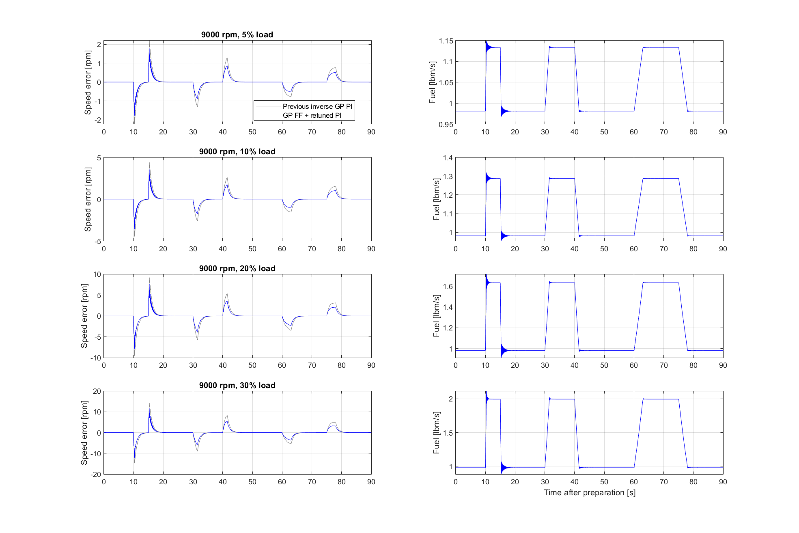
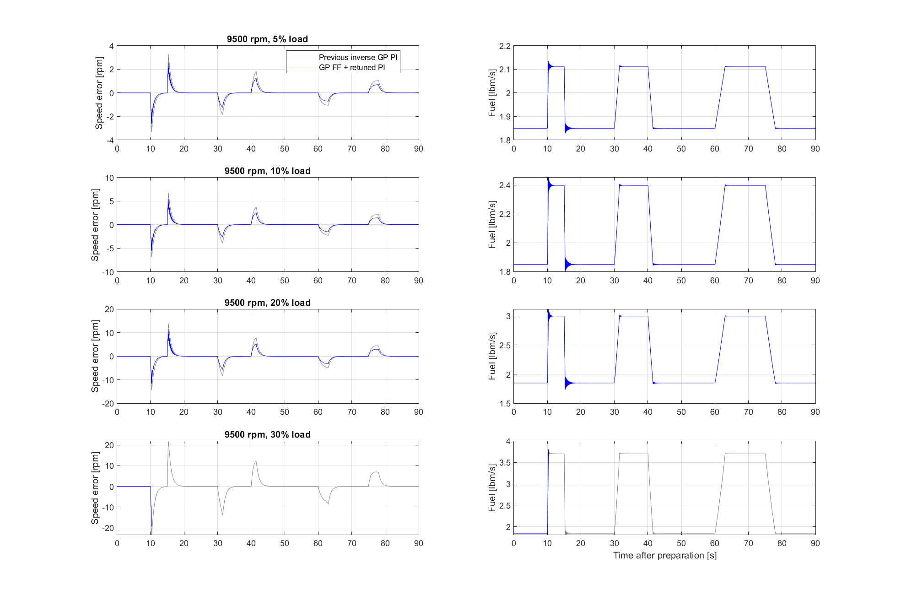
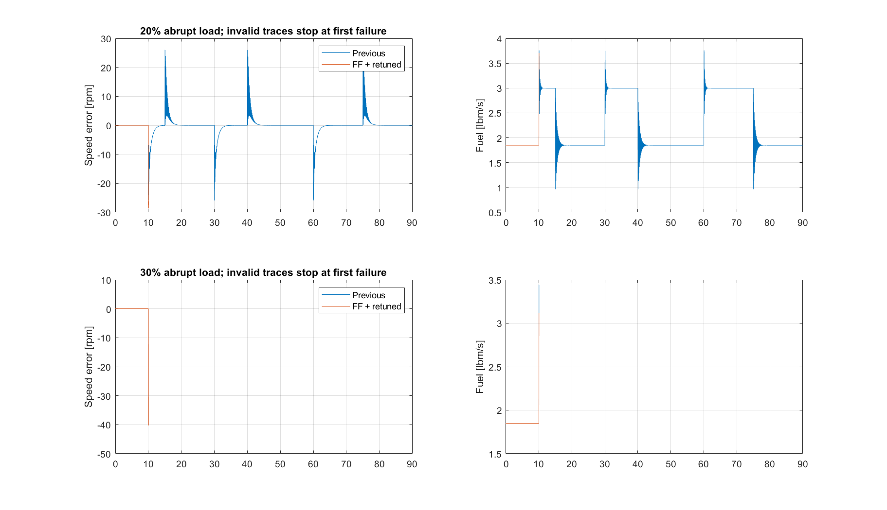

# Inverse-GPR feedforward plus retuned fuel-domain PI

Previous gains: Kp=4, Ki=40 /s. Selected gains: **Kp=3, Ki=60 /s**.

The frozen inverse GP supplies v_ref=g(reference,0) and v_feedback=g(sensed speed,filtered acceleration). The enhanced command is sat(v_ref + Kp*(v_ref-v_feedback) + I). Before the 30 s handover, I tracks startup_PI-v_ref-Kp*error. Conditional integration uses the full unsaturated command. The feedforward term is logged as VF_setpoint; VF_integral is now the residual integral contribution. Sampling, sensor, plant, loads, GP, and fuel limits are inherited unchanged.

For constant reference, feedforward is constant and is absorbed by the bumpless integral offset. Same-gain ablation over four 9000 rpm cases gives maximum speed difference 1.3715e-07 rpm and fuel difference 7.931e-09 lbm/s. Improvements in this benchmark are therefore due to gain retuning; these tests do not establish an additional reference-tracking benefit from feedforward.

Eight gain pairs were evaluated on all four 9000 rpm ramp amplitudes (5,10,20,30%), minimizing mean RMSE normalized by the archived original speed PI. Every training case must pass solver, positive surge-margin, finite-signal and pre-disturbance settling checks. Gains were frozen before the 9500 rpm held-out tests. This is a finite local gain search, not a global optimum. Full-run metrics are withheld after any invalid plant solve.

|rpm|load %|shape|previous valid|new valid|old RMSE|new RMSE|reduction %|old peak|new peak|min new margin %|
|---|---|---|---|---|---|---|---|---|---|---|
|9000|5|ramps|1|1|0.37056|0.25123|32.2|2.2262|1.7902|29.693|
|9000|10|ramps|1|1|0.74408|0.50446|32.2|4.4649|3.6055|24.939|
|9000|20|ramps|1|1|1.5809|1.0721|32.2|9.4784|7.8939|15.201|
|9000|30|ramps|1|1|2.4666|1.6707|32.3|14.706|12.133|7.0366|
|9500|5|ramps|1|1|0.52217|0.35465|32.1|3.3011|2.6533|22.188|
|9500|10|ramps|1|1|1.0911|0.74137|32.1|6.8694|5.5798|17.143|
|9500|20|ramps|1|1|2.2837|1.5517|32.1|14.425|11.717|8.2285|
|9500|30|ramps|1|0|3.6814|NaN|NaN|23.32|NaN|NaN|
|9500|20|steps|1|0|3.0951|NaN|NaN|26.019|NaN|NaN|
|9500|30|steps|0|0|NaN|NaN|NaN|NaN|NaN|NaN|

Fuel-domain gains are not speed-domain PI gains. The GP was trained at nominal zero shaft load. At 9000 rpm, negative speed excursions leave its training speed range; outside-training percentages remain in summary.csv. Small positive surge margin is not a robustness guarantee.

