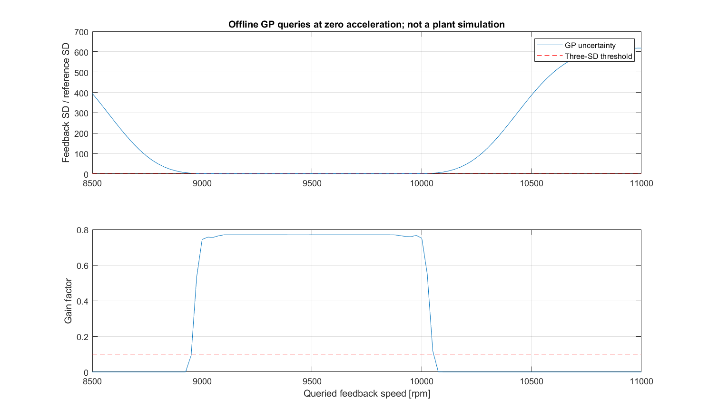
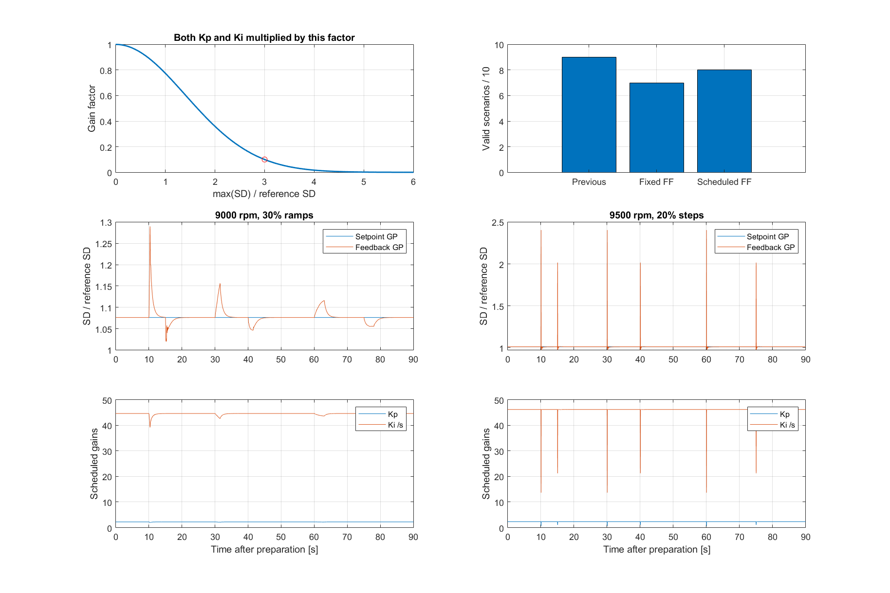
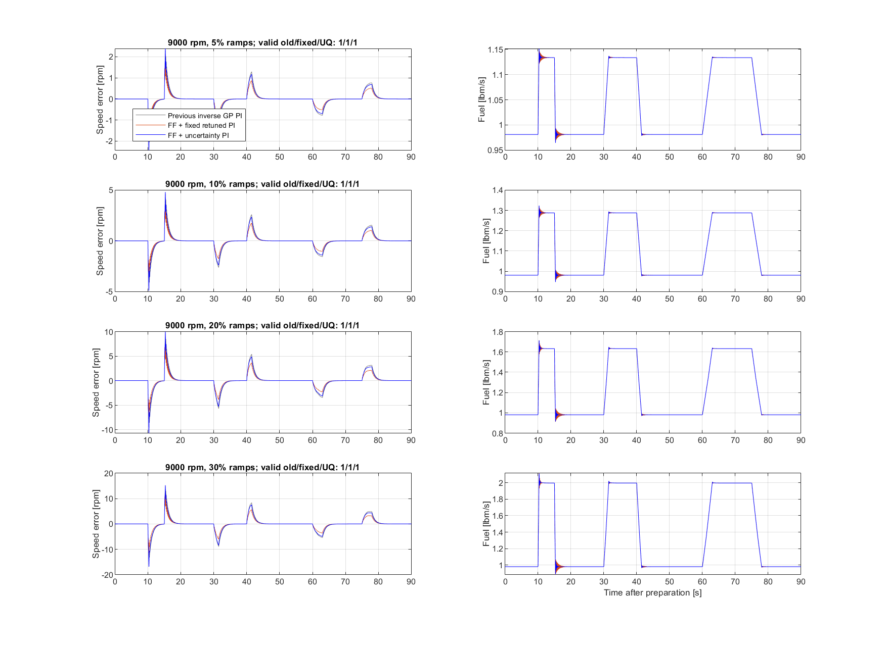
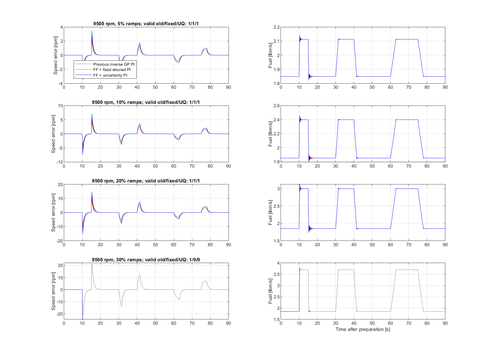
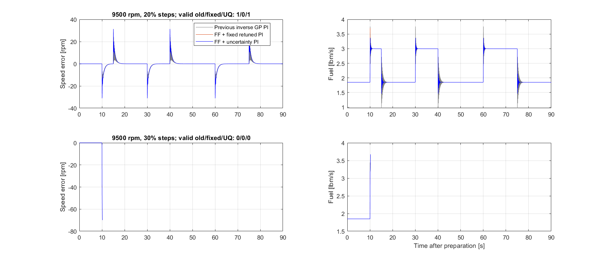

# Inverse-GPR fuel controller: feedforward, retuning, and uncertainty scheduling

Previous inverse-GPR PI: Kp=4, Ki=40 /s. Fixed feedforward retuning: Kp=3, Ki=60 /s. The scheduled controller uses these same base gains, scaled online by the uncertainty of both inverse models.

## Scheduling rule

Let sigma_max=max(sigma_setpoint,sigma_feedback), s=sigma_max/sigma_ref, and **alpha=10^(-(s/3)^2)**. Then **Kp=alpha*3**, **Ki=alpha*60 /s**. Alpha is 1 at zero uncertainty, 0.774264 at one reference SD, 0.1 at three reference SDs, and 0.0001 at six. It approaches zero monotonically.

The fixed reference SD is **0.00117869140424 lbm/s**, the median predictive response SD evaluated at all 600 training locations. It is computed without benchmark outcomes. Thus the three-SD point is **0.00353607421272 lbm/s**. This is a normalized uncertainty threshold, not a Gaussian tail-probability calculation. Response SD includes fitted observation noise; the latent-only SD is not used.

The exact GP uses its saved Cholesky factor online. Feedforward is g(reference,0); feedback is g(sensed speed,causally filtered acceleration). The command is clip(feedforward+Kp*error+I,0.2,4). The acceleration setpoint is zero in these tests. Neither actual shaft load nor the future disturbance schedule enters the controller.

When Kp changes, I is adjusted by (Kp_previous-Kp_current)*error before the command is formed. This cancels the jump caused solely by changing a gain, while leaving the error response gain scheduled. Ki changes the integral increment; the accumulated load-compensation integral is retained as gains approach zero. Startup tracking and conditional anti-windup use the full FF+PI command.

## Comparison

Valid scenarios: previous **9/10**, fixed FF **7/10**, scheduled FF **8/10**. Invalid runs have no full-run RMSE or peak score; plotted traces stop at first invalid sample.

Scheduling reduces RMSE by **7.4 to 11.9%** versus the previous controller across the seven mutually valid ramp cases, while being slower than fixed FF tuning. In the 9500 rpm 20% step case, it restores validity relative to fixed FF and raises minimum surge margin from the previous controller value of **0.673% to 4.96%**, at the cost of RMSE increasing from **3.095 to 3.758 rpm**. The 9500 rpm 30% ramp and step cases remain invalid. This is a measured tradeoff, not an across-the-board improvement.

|rpm|load %|shape|old valid|fixed valid|scheduled valid|old RMSE|fixed RMSE|scheduled RMSE|UQ improvement vs old %|UQ min margin %|
|---|---|---|---|---|---|---|---|---|---|---|
|9000|5|ramps|1|1|1|0.37056|0.25123|0.33785|8.83|29.589|
|9000|10|ramps|1|1|1|0.74408|0.50446|0.67974|8.65|24.78|
|9000|20|ramps|1|1|1|1.5809|1.0721|1.4523|8.13|15.148|
|9000|30|ramps|1|1|1|2.4666|1.6707|2.284|7.4|6.9884|
|9500|5|ramps|1|1|1|0.52217|0.35465|0.46015|11.9|22.058|
|9500|10|ramps|1|1|1|1.0911|0.74137|0.9616|11.9|16.984|
|9500|20|ramps|1|1|1|2.2837|1.5517|2.0121|11.9|8.0702|
|9500|30|ramps|1|0|0|3.6814|NaN|NaN|NaN|NaN|
|9500|20|steps|1|0|1|3.0951|NaN|3.7578|-21.4|4.9578|
|9500|30|steps|0|0|0|NaN|NaN|NaN|NaN|NaN|

The fixed gain grid was selected only on 9000 rpm ramp cases. The uncertainty schedule uses that frozen pair without retuning against 9500 rpm results. See the preceding fixed-feedforward study for the eight-pair grid and same-gain ablation, which established constant-reference feedforward equivalence to an integral offset.

Verification: maximum online-vs-exported GP SD difference **5.93467e-13 lbm/s**; maximum integral recurrence error **0 lbm/s**. Every run checks scheduled gains, command reconstruction, GP means, load replay, complete sample count, solver residuals, iterations, settling and positive surge margin.

The GP SD is model-conditional uncertainty. It does not include sensor-input uncertainty, hyperparameter uncertainty, or systematic errors from unmodeled shaft load. A confident GP can still be physically wrong. This scheduler is an uncertainty-based attenuation heuristic, not a stability guarantee or a surge-margin controller. Standard deviation can remain almost constant near the fitted noise floor, in which case scheduling mainly acts as gain derating.

Across valid runs, the smallest gain factor was **0.227746** and the largest SD/reference ratio was **2.40477**. The offline uncertainty probe queries the actual frozen GP from 8500 to 11000 rpm at zero acceleration, holding the setpoint GP at 9500 rpm; it illustrates the scheduler outside the modeled speed band without claiming plant validity there.

