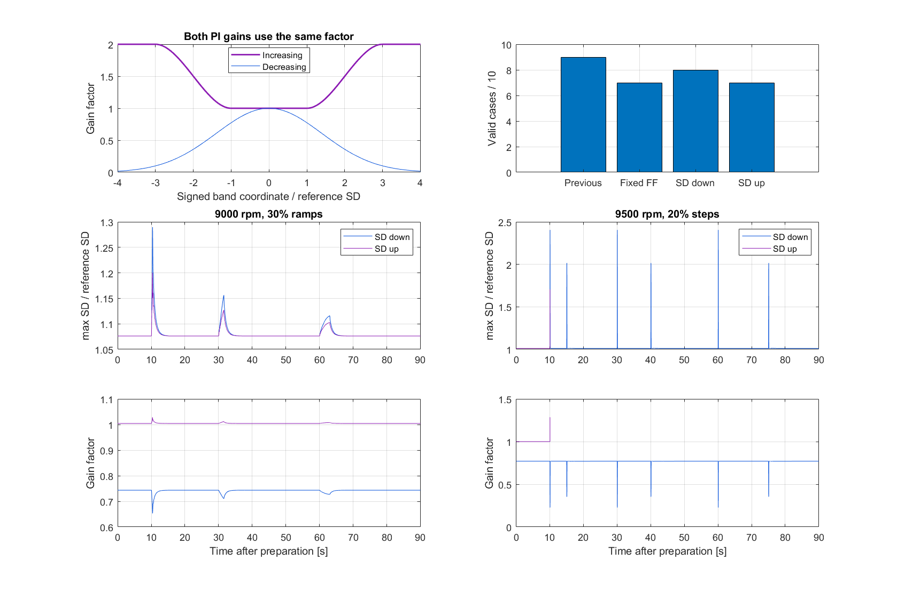
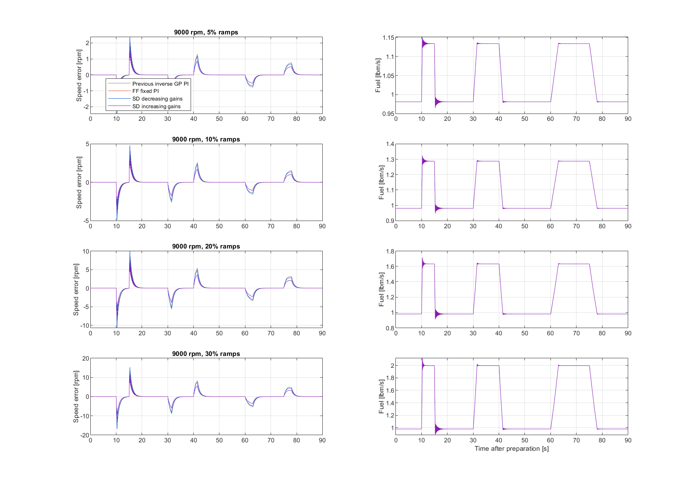
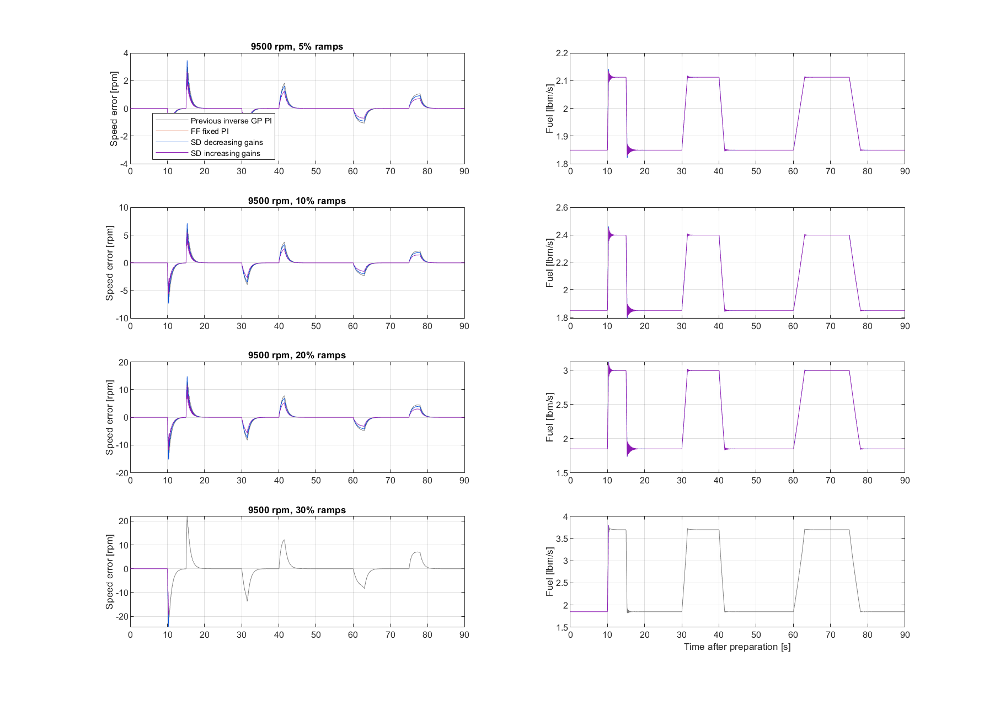
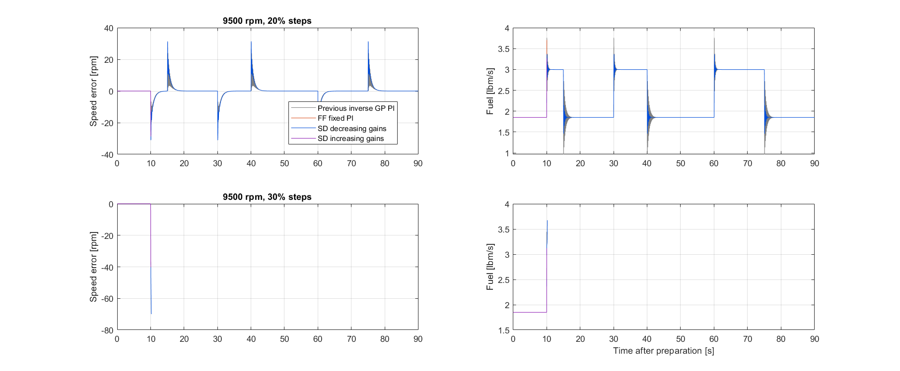

# Increasing inverse-GPR uncertainty gain scenario

The new scenario keeps factor **1 through one reference SD**, then smoothly increases to **2 at three reference SDs**, capped at 2 thereafter. It uses the same base gains Kp=3 and Ki=60 /s, frozen GP and reference SD as the previous FF scheduling study.

Define s=max(sigma_setpoint,sigma_feedback)/sigma_ref, x=clip((s-1)/2,0,1), and **factor=1+3*x^2-2*x^3**. Both gains are multiplied by this factor. The slope is zero at s=1 and s=3. SD is nonnegative, so the requested plus/minus bands are interpreted symmetrically by magnitude; speed-error sign is not used. Sigma_ref=**0.00117869140424 lbm/s**, the median response SD at the 600 training locations.

The full controller remains feedforward + scheduled fuel-domain PI with causal acceleration filtering, bumpless gain transfer, startup tracking, conditional anti-windup and fuel limits. Only the gain schedule changes relative to the SD-down scenario; no new base-gain search is performed.

Valid scenarios: previous **9/10**, fixed FF **7/10**, SD down **8/10**, SD up **7/10**. Scores are withheld after any invalid plant result; plot traces stop at the first invalid sample.

|rpm|load %|shape|previous RMSE|fixed RMSE|SD-down RMSE|SD-up RMSE|SD-up valid|SD-up minimum margin %|
|---|---|---|---|---|---|---|---|---|
|9000|5|ramps|0.37056|0.25123|0.33785|0.25012|1|29.7|
|9000|10|ramps|0.74408|0.50446|0.67974|0.50209|1|24.952|
|9000|20|ramps|1.5809|1.0721|1.4523|1.0662|1|15.204|
|9000|30|ramps|2.4666|1.6707|2.284|1.6594|1|7.0493|
|9500|5|ramps|0.52217|0.35465|0.46015|0.35462|1|22.188|
|9500|10|ramps|1.0911|0.74137|0.9616|0.74129|1|17.144|
|9500|20|ramps|2.2837|1.5517|2.0121|1.5515|1|8.2288|
|9500|30|ramps|3.6814|NaN|NaN|NaN|0|NaN|
|9500|20|steps|3.0951|NaN|3.7578|NaN|0|NaN|
|9500|30|steps|NaN|NaN|NaN|NaN|0|NaN|

Fuel oscillation is also quantified in comparison_all_methods.csv: for each of six load transitions, measure the two seconds after the ramp finishes (or after the step), sum abs(diff(fuel)), subtract the absolute net fuel change, then sum those six excess-total-variation values. This measures repeated reversals rather than monotonic adjustment. The largest two-second fuel range is reported separately. Invalid runs have no full-run ringing score.

Verification: maximum GP SD replay error 5.45967e-13 lbm/s; maximum bumpless integral recurrence error 0 lbm/s. Endpoint factors [1,1,1.5,2,2,2] at normalized SD [0,1,2,3,6,infinity] and the max-of-either-model behavior are checked. Gain, command, GP mean, solver, load and sample-count checks are inherited.

Increasing uncertainty does not establish that higher feedback gains are stabilizing. The posterior SD reflects the nominal GP training distribution, not all loaded-plant model errors. These results test the requested alternative and do not assume it is superior.

